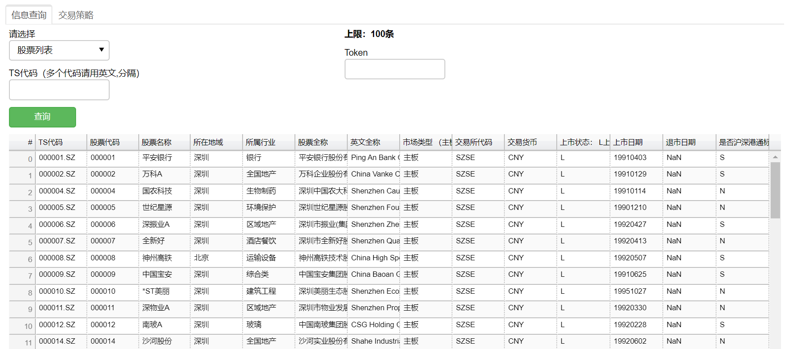
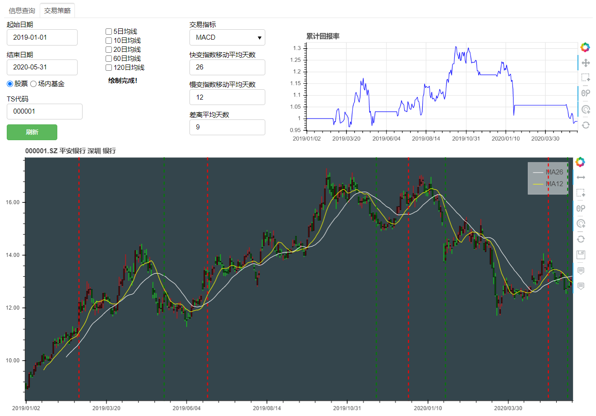

# web-quant
## 一个基于Python3的简易的数据查询、策略回测应用
演示网址：http://bokeh.tideillusion.xyz

Windows用户在[此处](https://github.com/tideillusion/web-quant/releases/download/v1.0.0/web-quant_v1.0.0.zip)下载`web-quant_v1.0.0.zip`，解压后运行`bokeh.exe`即可。软件需要访问网络，请放心同意。使用前请阅读README.txt。

其他用户可以通过`bokeh serve ./`来运行。需要安装如下依赖：
- numpy
- pandas
- re
- warnings
- pymysql
- functools
- talib
- time
- os
- bokeh

数据来源：tushare

共同作者（排名不分先后）：
孙云飞、李博文、胡娇芬、丁雨晴、沈佳卉、陈潇玥、沈屹凡、孙沛然、叶雨霖

